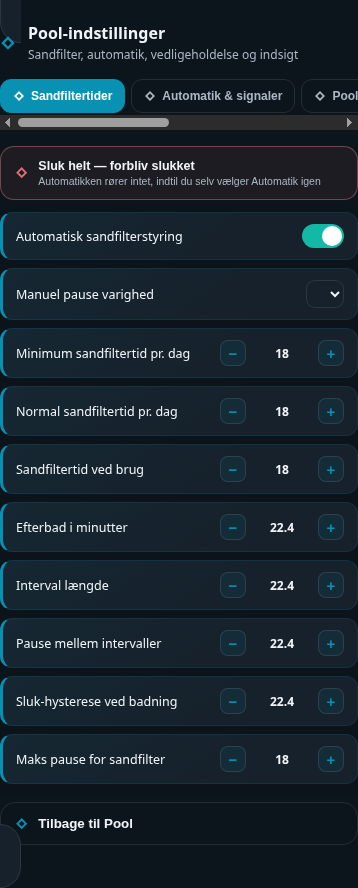

# HA Pool Settings Card

## Neutral mobile preview



> Rendered at 390 px mobile width with fictional Home Assistant entities and values. No private dashboard, person, address, camera, or sensor data is included.


A companion settings card for [ha-pool-card](https://github.com/MRDonnii/ha-pool-card)
that replaces a long, repetitive stack of native `entities` cards with one
clean, tabbed interface.

Settings are grouped into five tabs — Filter schedule, Automation &
signals, Comfort, Maintenance, Insight — and each row auto-detects the
entity's domain to render the right control:

| Domain | Control |
|---|---|
| `input_boolean` | Toggle switch |
| `input_number` | −/value/+ stepper (uses the entity's own `min`/`max`/`step`) |
| `input_select` | Dropdown |
| `input_button` | "Kør" button |
| `timer` | Active/inactive read-out |
| `input_datetime` | Formatted date/time (with a "Never" state for unset sentinel dates) |
| everything else | Read-only value row, tap for more-info |

A dedicated danger-styled action button (with a confirmation prompt) can be
attached to any section for the one thing that shouldn't just be another row
— e.g. force-stopping a pump.

## Configuration

```yaml
type: custom:ha-pool-settings-card
title: Pool-indstillinger
subtitle: Sandfilter, automatik, vedligeholdelse og indsigt
back_path: /your-dashboard/pool
sections:
  - title: Sandfiltertider
    icon: mdi:timer-cog-outline
    danger_action:
      label: Sluk helt — forbliv slukket
      desc: Automatikken rører intet, indtil du selv vælger Automatik igen
      icon: mdi:power-plug-off
      entity: input_select.pool_pump_override
      service: input_select.select_option
      data: { option: "Off" }
      confirm: Sluk poolpumpen helt?
    rows:
      - label: Automatisk sandfilterstyring
        entity: input_boolean.pool_automation_active
      - label: Normal sandfiltertid pr. dag
        entity: input_number.pool_pump_normal_hours
  # ...more sections
```

See `getStubConfig()` in the source for a complete real-world example with
five sections and ~40 rows.
